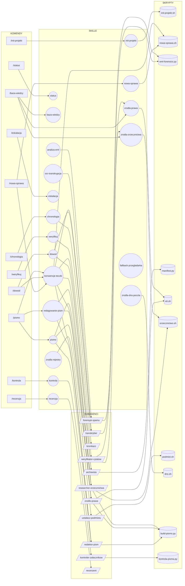

# Prompt: diagram powiązań kruczek

Poniższy prompt generuje diagram Mermaid pokazujący relacje między komendami, skillami, subagentami i skryptami pluginu kruczek.

---

## Prompt do wklejenia w Claude

```
Wygeneruj diagram Mermaid (flowchart LR) pokazujący powiązania w pluginie kruczek.

Zasady:
- Root (punkt wejścia użytkownika) to każda komenda /kruczek:<nazwa>
- Strzałki pokazują: co dana komenda triggeruje (skill, subagent, skrypt)
- Subagenci oznaczeni kształtem równoległoboku (["nazwa"])
- Skille oznaczone kształtem zaokrąglonym ((nazwa))
- Skrypty oznaczone kształtem cylindra [(nazwa)]
- Komendy oznaczone prostokątem [nazwa]
- Grupuj w subgraphy: KOMENDY, SKILLE, SUBAGENCI, SKRYPTY

Dane do zmapowania (z /kruczek:komendy):

KOMENDY i co wyzwalają:
- /init-projekt → skill:init-projekt → skrypt:init-projekt.sh
- /nowa-sprawa → skill:nowa-sprawa, skill:konwencje-teczki → skrypt:nowa-sprawa.sh
- /dowod → skill:dowod, skill:konwencje-teczki → agent:archiwista, agent:transkryber → skrypt:manifest.py, skrypt:eml-forensics.py
- /chronologia → skill:chronologia → agent:kronikarz
- /status → skill:status
- /baza-wiedzy → skill:baza-wiedzy, skill:zrodla-prawa, skill:zrodla-orzecznictwa
- /pismo → skill:pismo, skill:redagowanie-pism, skill:konwencje-teczki → agent:redaktor-pism, agent:zrodlo-prawa, agent:researcher-orzecznictwa → skrypt:build-pismo.py
- /kontrola → skill:kontrola → agent:kontroler-zalacznikow → skrypt:kontrola-pisma.py
- /weryfikuj → skill:weryfikuj → agent:weryfikator-cytatow → skill:zrodla-prawa, skill:zrodla-orzecznictwa
- /recenzja → skill:recenzja → agent:recenzent
- /eskalacja → skill:eskalacja

SKILLE WIEDZY (ładowane automatycznie przez kontekst, nie przez komendę):
- analiza-eml → agent:forensyk-spamu → skrypt:eml-forensics.py
- zrodla-dns-poczta → skrypt:dns.sh
- zrodla-rejestry → skrypt:podmiot.sh
- ocr-transkrypcja → agent:transkryber
- fallback-przegladarka (brak subagenta)
- zrodla-prawa → skrypt:eli.sh
- zrodla-orzecznictwa → skrypt:orzecznictwo.sh

Użyj validate_and_render_mermaid_diagram do walidacji przed pokazaniem.
```

---

## Jak wyświetlić diagram

- **VS Code** — rozszerzenie [Markdown Preview Mermaid Support](https://marketplace.visualstudio.com/items?itemName=bierner.markdown-mermaid), potem `Cmd+Shift+V`
- **GitHub** — renderuje automatycznie w podglądzie pliku `.md`
- **Online** — wklej kod diagramu na [mermaid.live](https://mermaid.live) (eksport PNG/SVG)
- **Claude Code** — agent `mermaid-diagram-specialist` może wygenerować zaktualizowaną wersję na podstawie promptu wyżej

---

## Diagram


